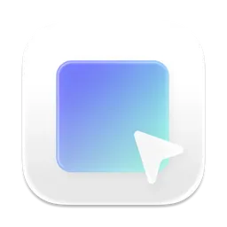
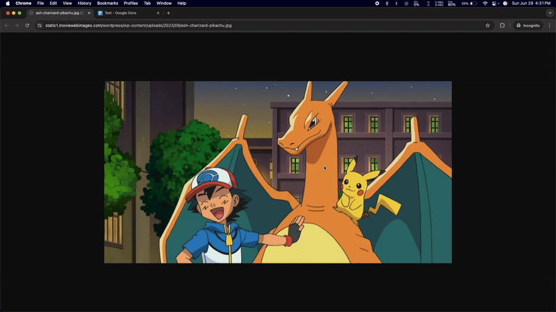

# Pointy

<div align="center">
  
  <p><em>A vibe-coded macOS screenshot + annotation app</em></p>
</div>

## Demo



## Features

- **Annotation Tools**: Select from various tools like pencil, arrow, rectangle, rounded rectangle, and circle.
- **Keyboard Shortcuts**: Use number keys to quickly switch tools and the Escape key to exit.
- **Color Picker**: Choose colors using a color picker with hue sliders and preset options.
- **Resize**: Resize drawn annotations with handles
- **Status Bar Integration**: Includes a status bar icon with a right-click Quit button and left-click to open annotation panel.

### Option 1: Build from Source

1. Clone the repository:
   ```bash
   git clone https://github.com/sdivakarrajesh/pointy.git
   ```
2. Navigate to the project directory:
   ```bash
   cd pointy
   ```
3. Open the project in Xcode:
   ```bash
   open pointy.xcodeproj
   ```
4. Build and run the project using Xcode (⌘+R)

### Option 2: Direct Download

Download the latest release from the [Releases](https://github.com/sdivakarrajesh/pointy/releases) page.

## Usage

- Launch the app from the `/Applications` folder or directly from Xcode.
- Use the annotation tools to draw directly on your screen.
- Access the status bar menu for quick actions.

### Prerequisites

- macOS 12.0 or later
- Xcode 14.0 or later
- Swift 5.7+

## Permissions

Pointy requires the following permissions to function properly:

- **Accessibility**: To stay on top of other windows and receive keyboard events
- **Screen Recording**: To display annotations over all applications

Grant these permissions in **System Preferences > Security & Privacy > Privacy**.

## Contributing

Contributions are welcome! Please feel free to:

- Report bugs by opening an [issue](https://github.com/sdivakarrajesh/pointy/issues)
- Suggest new features
- Submit pull requests

## License

This project is licensed under the MIT License. See the LICENSE file for details.

## Acknowledgments

Built with SwiftUI and AppKit for macOS
